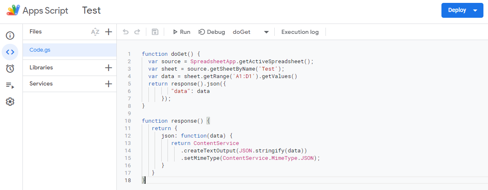
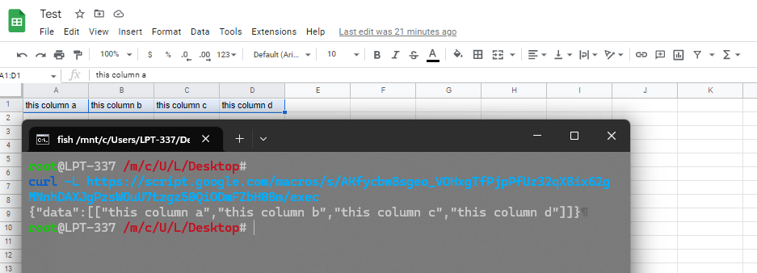

## How to Use
1. Open your sheets
2. Click Extensions
3. Select Apps Script
4. Copy Code.gs from this repo to your project
5. Edit according to your needs
6. Click Deploy > New deployment > Click Gear Icon > Select Web App > Edit Who has access to Anyone > Click Deploy
7. Copy your web app URL

## Sample Code

## Sample Result

## Notes
- Don't forget to Redeploy after you change the code
- Click Deploy > Manage deployments > Click Pen Icon > in Version Select `New version` > Click Deploy
